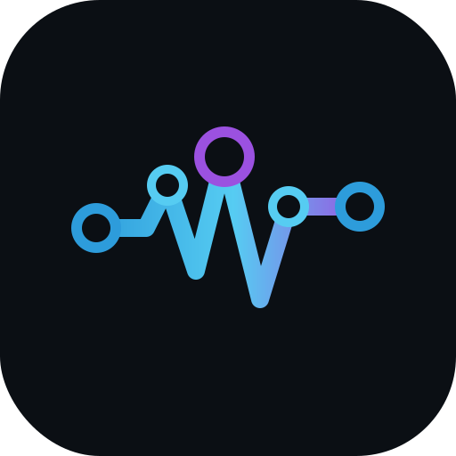

# AI Audio Studio Platform
<p align="center"></p>


[](https://www.gnu.org/licenses/agpl-3.0) © 2026 Kylie-Grace Mars-Snyder. Licensed under [AGPL-3.0](LICENSE). See [docs/USAGE.md](docs/USAGE.md) for usage intent and commercial collaboration details.


> **Operator-ready MVP, not a finished product.** The platform runs cleanly end-to-end: Docker stack, live dashboard, approval-gated job FSM, CRM, worker execution, and LAN/HTTPS access. The five core automation modules are functional. What's still being built is the novice onboarding layer — some setup still requires editing environment files rather than pointing and clicking. If you're comfortable with a terminal and Docker, it's usable today. If you're expecting a polished installer, that's the next phase.

Automated studio operations platform for independent recording studios. Handles the operational layer — lead replies, inbox triage, session prep, audio QC, social content, and DAW revision execution — while keeping every client-facing action behind a human approval gate. The system's job is to do 90% of the preparation work so your job becomes fast, informed review rather than starting from scratch.

---

## What This Is

A two-machine platform: a **Mac mini** runs the always-on control plane (Docker stack, AI inference, dashboard), and a **Mac Pro** (or any second Mac) runs the **studio-worker** that executes file operations and DAW scripts. It also runs on a single machine with the `--profile local-worker` flag.

Five core automation modules:

1. **Lead Intake** — Form/DM/email → normalized lead → scored reply draft → your approval
2. **Inbox Triage** — Gmail read-only → classify → reply draft → your approval
3. **Social/Content Pipeline** — Brief → per-platform captions → your approval
4. **Session Prep & Audio QC** — Stems → validate → organize → LUFS/peak/phase report
5. **Mix Planner & Revision Parser** — Client notes → DAW change objects → SoundFlow or ReaScript → your approval → execution

Nothing is sent, posted, or executed without your explicit approval. The system fails closed.

---

## Documentation

New to the platform? Start with the [overview](docs/guide/00-overview.md) to understand the mental model, then follow the [quick start](docs/setup/01-quick-start.md) to get running in under 30 minutes.

### User Guide

| Document | What's covered |
|----------|----------------|
| [00 — Overview](docs/guide/00-overview.md) | Mental model, two-machine architecture, five modules, approval tiers |
| [01 — First Run](docs/guide/01-first-run.md) | First-time setup walkthrough, workspace questionnaire |
| [02 — Daily Operations](docs/guide/02-daily-operations.md) | Morning check, approval queue, monitoring, concierge |
| [03 — Approval Workflow](docs/guide/03-approval-workflow.md) | Every approval type explained in detail |
| [04 — Leads & Inbox](docs/guide/04-leads-and-inbox.md) | Lead intake, inbox triage, Gmail connection |
| [05 — Session & DAW](docs/guide/05-session-and-daw.md) | Session prep, mix planning, style profiles |
| [06 — Audio QC](docs/guide/06-audio-qc.md) | All six measurements, effort levels, reading reports |
| [07 — Revisions](docs/guide/07-revisions.md) | Revision notes → execution plans → DAW execution |
| [08 — Delivery](docs/guide/08-delivery.md) | QC-gated delivery packaging and approval |
| [09 — Social Content](docs/guide/09-social-content.md) | Content briefs, per-platform captions, asset manifest |
| [10 — Concierge](docs/guide/10-concierge.md) | Control Room Assistant capabilities and limitations |
| [11 — Settings & Modules](docs/guide/11-settings-and-modules.md) | All settings, module enable/disable, style profiles |
| [12 — Integrations](docs/guide/12-integrations.md) | Gmail, Instagram, Facebook, alert webhooks step-by-step |
| [13 — Troubleshooting](docs/guide/13-troubleshooting.md) | Common failures: symptom → cause → fix |

### Setup & Installation

| Document | What's covered |
|----------|----------------|
| [01 — Quick Start](docs/setup/01-quick-start.md) | Single-machine setup in 11 steps |
| [02 — Split Mode](docs/setup/02-split-mode.md) | Two-machine setup: network, storage, path translation |
| [03 — Environment Variables](docs/setup/03-environment-variables.md) | Every env var, default, and required status |
| [04 — Ollama](docs/setup/04-ollama.md) | Local LLM setup, model management, memory tuning |
| [05 — HTTPS & LAN](docs/setup/05-https-and-lan.md) | Caddy setup, certificate trust, HTTPS URLs |
| [06 — Worker Setup](docs/setup/06-worker-setup.md) | Studio-worker: Docker vs native, capabilities, DAW paths |

### Reference

| Document | What's covered |
|----------|----------------|
| [API Reference](docs/reference/api-reference.md) | Every service endpoint, headers, bodies, responses |
| [Database Schema](docs/reference/database-schema.md) | Every table, column, constraint, and relationship |
| [FSM States](docs/reference/fsm-states.md) | Job state machine: all states, transitions, enforcement |
| [n8n Workflows](docs/reference/n8n-workflows.md) | All 8 starter workflows, webhook URLs, payloads |
| [Service Map](docs/reference/service-map.md) | All services: port, profile, purpose, endpoints |

### Architecture

| Document | What's covered |
|----------|----------------|
| [Safety Model](docs/architecture/safety-model.md) | Why approval-gated, permission tiers, fail-closed design |
| [Two-Machine Design](docs/architecture/two-machine-design.md) | Why the split exists, how communication works |

---

## Safety Model

No outbound action happens without explicit human approval. This is the architectural foundation, not a safety feature bolted on after the fact.

| Tier | Name | What it can do |
|------|------|----------------|
| 1 | Read | Analyze and observe — zero client-facing risk |
| 2 | Draft | Write to internal queue — zero send risk |
| 3 | Queue | Request human approval — gated, requires explicit yes |
| 4 | Narrow Auto | Pre-approved bounded actions — file organization only |

**The system fails closed.** If the approval system is unavailable, no jobs proceed. They don't default-approve. They wait.

---

## Quick Start

### Prerequisites
- Docker Desktop installed and running
- Minimum 16 GB RAM (Ollama's planner model needs memory — more is better)
- macOS (the worker requires macOS for DAW execution; the control plane runs anywhere Docker runs)

### First-time setup

```bash
# 1. Clone
git clone <repo-url> ai-audio-studio
cd ai-audio-studio

# 2. Configure environment
cp infra/env.example infra/.env
# Edit infra/.env — fill in POSTGRES_PASSWORD, API keys, and machine-specific paths

# 3. Start Ollama (native — not Docker)
bash scripts/start-ollama.sh

# 4. Start the control plane
docker compose --env-file infra/.env -f infra/docker-compose.yml up -d

# 5. Import n8n starter workflows (one-time, idempotent)
bash scripts/bootstrap_n8n.sh infra/.env

# 6. Open the dashboard
open http://localhost:3000
```

Complete the first-run workspace questionnaire, then follow [01 — First Run](docs/setup/01-quick-start.md) for the full walkthrough.

For DAW modules (audio-qc, session-prep, revision-parser, delivery-packager, mix-planner):
```bash
docker compose --profile daw --env-file infra/.env -f infra/docker-compose.yml up -d
```

For a second studio Mac as the execution worker:
```bash
# On the worker machine
docker compose --env-file infra/.env -f infra/docker-compose.worker.yml up -d
```

### Verify health

```bash
curl http://localhost:8080/health    # project-state
curl http://localhost:8090/health    # crm-api
curl http://localhost:8100/health    # openclaw
curl http://localhost:11434/api/tags # ollama (lists loaded models)
open http://localhost:3000           # dashboard
```

---

## Architecture

### Deployment modes

**`single_machine`** — one Mac runs everything. Use `--profile local-worker` if you want bounded DAW tasks to execute locally.

**`control_plane_plus_worker`** — Mac mini runs the control plane, Mac Pro (or any second Mac) runs the studio-worker for DAW execution.

### Service layout

```
CONTROL PLANE
  postgres       :5432   Shared database (internal)
  n8n            :5678   Webhook automation
  project-state  :8080   Job FSM, approval queue, audit log
  crm-api        :8090   Leads, projects, style profiles, settings
  openclaw       :8100   Orchestration + routing
  caddy          :80/443 HTTPS front door

AUTOMATION MODULES
  content-pipeline :8110  Social captions
  audio-qc         :8120  Loudness, peak, phase (--profile daw)
  lead-intake      :8130  Lead normalization
  inbox-triage     :8140  Gmail triage
  session-prep     :8150  Stem validation (--profile daw)
  revision-parser  :8160  Notes → DAW ops (--profile daw)
  delivery-packager :8170 Delivery assembly (--profile daw)
  mix-planner      :8180  Mix planning (--profile daw)

WORKER (separate machine or --profile local-worker)
  studio-worker  :8190   File and DAW execution agent

AI RUNTIME (native macOS — not Docker)
  ollama         :11434  Local LLM (qwen2.5:14b + qwen2.5:3b)
```

### Network access

- LAN IP access: `http://<control-plane-ip>:3000` (set `BIND_HOST=0.0.0.0`)
- HTTPS (after certificate trust): `https://$CONTROL_PLANE_HOST`
- n8n: `https://n8n.$CONTROL_PLANE_HOST`
- OpenClaw: `https://openclaw.$CONTROL_PLANE_HOST`

---

## Development

```bash
# Run tests
docker compose -f infra/docker-compose.yml run --rm project-state pytest
docker compose -f infra/docker-compose.yml run --rm audio-qc pytest

# Headless validation
bash scripts/validate_stack.sh infra/env.example

# View logs
docker compose -f infra/docker-compose.yml logs -f openclaw

# Restart a service
docker compose -f infra/docker-compose.yml restart project-state

# Apply DB migrations
docker compose -f infra/docker-compose.yml exec postgres \
  psql -U studio -d studiodb -f /docker-entrypoint-initdb.d/init.sql
```

Task files in `tasks/` define the implementation sequence for AI agents. Each file contains purpose, dependencies, file list, input/output contracts, security constraints, and acceptance tests.

---

## Implementation Status

**Solid today:**
- Control plane starts cleanly under Docker Compose
- Dashboard surfaces health, approvals, workers, rules, alerts, and bootstrap state
- `project-state` persists jobs, approvals, audit records, worker nodes, and tasks
- `crm-api` persists projects, leads, and style profiles
- `openclaw` seeds default orchestration rules, rule packs, and playbooks
- n8n workflows import with a one-shot bootstrap script
- Single-machine and split-machine deployment both functional
- Control Room Assistant backed by live stack context and Ollama
- Persisted workspace settings, module settings, and style profiles

**Still being built:**
- Novice-friendly first-run flow that doesn't require env file editing for normal setup
- Full operator-safe settings coverage for all services
- End-to-end automations beyond current MVP pathways
- Full DAW execution validation on production hardware
- Outbound alert connectors beyond the webhook URL

---

## Older Runbooks

Legacy operational documents still in `docs/runbooks/`:
- [docs/runbooks/local-network.md](docs/runbooks/local-network.md) — early LAN setup notes
- [docs/runbooks/legacy-cutover.md](docs/runbooks/legacy-cutover.md) — retiring legacy infra
- [docs/runbooks/studio-worker.md](docs/runbooks/studio-worker.md) — original worker setup notes
